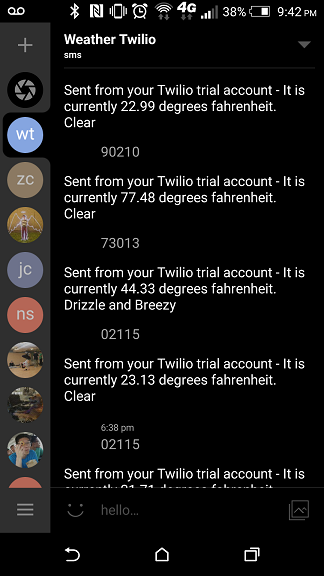

# Forecast SMS

Get current temperature and weather conditions by providing zip code, through SMS

Will eventually provide more relevant weather information.



### Motivation

Main motivation was to just get more hands-on experience working with cool APIs and to get more familiar with routing calls in Node.js.

Secondary motivation was to simply provide a way to get the current weather without accessing the Internet. Perhaps this could be useful for those without Internet on their phones, or for flip-phone users.

### Breakdown
* User sends SMS containing a zip code to Twilio number
* Twilio makes POST (or GET) request to API endpoint specified (on my end)
* Route call to appropriate file
* Geonames API call to get latitude and longitude from the given zip code
* Forecast API call with the above coordinates to get current weather
* Twilio SMS response containing temperature and weather conditions (hoping to expand this more)

### Tech

Forecast SMS takes advantage of:
* Node.js, with the following modules
  * twilio
  * async
  * body-parser
  * express
  * request
* Twilio API (for SMS)
* Forecast API (for weather)
* MongoDB (maps zip codes to coordinates/other info)

### General
Currently only working for verified phone numbers because I'm on a Twilio trial account (and I'm too cheap to upgrade)

Hosted on main site at the moment and until I decide to separate the two (sorry), routing will be handled like so on the Node.js web server:

```
// Some stuff above this line
var app          = express();
var router       = express.Router();
// Handle route in forecast_sms.js
var forecast_sms = require('./routes/forecast_sms').router;
app.use('/API_ENDPOINT_HERE', forecast_sms);
// Some stuff below this line
```
### Changelog
3/7/15 - Removed Geonames API and replaced with MongoDB to fetch coordinates (loaded in data using a CSV file from 2000 Census). Text response sends out a bit faster now after removing extraneous API call.